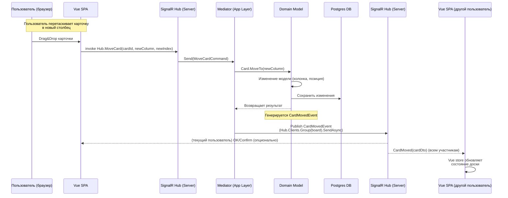

Отлично, спасибо. Я подготовлю архитектурный план для Organetto, учитывая монолитный backend на .NET 8 с Postgres, хранение файлов в S3-совместимом хранилище, деплой на VPS (Reg.ru), модель с одним workspace на пользователя и Vue 3 frontend. Включу слоевые и C4-диаграммы, реализацию realtime через SignalR, RBAC, тарифные ограничения, и roadmap от MVP до версии 1.0.

Дайте мне немного времени — скоро всё будет готово.


# Архитектурный план Organetto

## Обзор решений

Organetto – это лёгкая канбан-доска для персональных проектов и малых команд. Продукт будет реализован как **монолитное веб-приложение** с чётким разделением на фронтенд (SPA на Vue 3) и бекенд (ASP.NET Core 8) по принципам *Clean Architecture*. Такой подход ставит бизнес-логику в центр, а детали инфраструктуры выносятся на периферию. Архитектура обеспечит низкую связанность компонентов, облегчит тестирование и последующую доработку функционала.

**Стек и развёртывание:** Бекенд на C# 12 / .NET 8, база данных PostgreSQL, реалтайм-общение через SignalR (WebSocket Hub), аутентификация пользователей через внешний сервис Firebase Auth, хранение файлов-вложений в облачном хранилище S3. Всё приложение деплоится как Docker-контейнер на VPS (используется хостинг Reg.ru) – контейнеризация упрощает установку зависимостей и обновление приложения на сервере. CI/CD конвейер (GitHub Actions) будет автоматически собирать образ и выкатывать его на сервер, что избавляет от ручной рутины и исключает ошибки деплоя. Логи приложения собираются с помощью Serilog (в формате JSON) и могут отправляться в централизованное хранилище (например, Grafana Loki) для удобного поиска. Мониторинг производительности реализуется экспонированием метрик Prometheus (через библиотеку *prometheus-net* или OpenTelemetry) и визуализацией в Grafana – это позволит отслеживать загрузку CPU, скорость отклика API, количество активных подключений и пр. в реальном времени.

**Высокоуровневое взаимодействие компонентов:** Пользователь работает через **SPA-приложение** (Vue 3 + TypeScript), которое загружается из браузера и общается с бекендом по HTTPS и WebSocket. При аутентификации SPA обращается к сервису Firebase Auth (например, всплывающее окно для входа Google), получает ID-токен и при последующих запросах отправляет этот токен бекенду. Бекенд (ASP.NET Core) проверяет валидность токена (с помощью SDK Firebase либо вручную по публичному ключу) и извлекает идентификатор пользователя. После этого SPA через REST API выполняет CRUD-операции (создание доски, карточки и т.п.), а для синхронизации в реальном времени подключается к **SignalR Hub** на сервере. Все пользовательские данные хранятся в PostgreSQL (самоописуемые JSON-поля не требуются – используем реляционную схему с явными связями). Вложения (файлы) сохраняются во внешнем S3-хранилище, а в базе хранятся только ссылки. Ниже представлена **диаграмма высокоуровневой архитектуры** с основными компонентами и связями:

```mermaid
flowchart LR
    user[Пользователь]
    subgraph Browser[Браузер с SPA]
        vueSPA["Органетто (Vue 3 SPA)"]
    end
    subgraph Server["Органетто API-сервер (ASP.NET Core 8)"]
        api[Web API Controllers\n+ SignalR Hubs]
        appLayer[Application Layer\n(MediatR handlers,\nservices)]
        domainLayer[Domain Layer\n(Entities, VOs,\nDomain Services)]
        infraLayer[Infrastructure\n(EF Core, Repos,\nIntegrations)]
    end
    db[(PostgreSQL\nDatabase)]
    storage[(AWS S3\nFile Storage)]
    firebase[(Firebase\nAuth)]
    payments[(Payment Gateway\nAPI)]
    
    user --> vueSPA
    vueSPA -- REST API --> api
    vueSPA -- WebSocket --> api
    api --> appLayer --> domainLayer --> infraLayer --> db
    infraLayer --> storage
    api -- verify token --> firebase
    infraLayer --> payments
```

*Рис. 1: Высокоуровневая схема – SPA во Vue взаимодействует с монолитным API (бекенд), использующим БД, внешнее хранилище и сервисы.* Браузер загружает SPA и взаимодействует с сервером через HTTP(S) и WebSocket. Сервер обслуживает запросы API и уведомления в реальном времени, обращаясь к базе данных и внешним сервисам (Firebase для аутентификации, S3 для файлов, платёжный шлюз для оплаты подписки). Такая контейнерная (C4) диаграмма отражает развёртывание: один контейнер-сервер с приложением и отдельные внешние сервисы.

## Архитектура backend

**Общие принципы:** Бекенд реализован как *монолитное* веб-приложение, организованное по принципам **Clean Architecture** (он же Hexagonal или Onion Architecture). Это означает, что код разделён на несколько логических слоёв с явными зависимостями: сердцевина – *Domain* (содержащая бизнес-логику и модели предметной области), над ней – *Application* (координирует выполнение use-case’ов, содержит обработчики команд/запросов, Mediator, и т.д.), далее – *Infrastructure* (реализации интерфейсов для работы с БД, файлами, внешними API), и снаружи – *Web (UI) layer* (контроллеры Web API, хабы SignalR, которые принимают запросы от фронтенда). При компиляции зависимости направлены **вовнутрь**, к центру: внешние слои знают о внутренних интерфейсах, но не наоборот. Благодаря этому инфраструктурные детали легко заменяются, а бизнес-правила не зависят от технологий хранения или транспорта данных. **Domain и Application не ссылаются на ASP.NET Core**, они изолированы; контроллеры и хабы работают через абстракции (интерфейсы, Mediator) и не содержат бизнес-логики. Такой подход упрощает тестирование и сопровождение: например, можно писать unit-тесты для Application Core без поднятия БД.

**Слои и модули монолита:** Внутри монолита код дополнительно структурирован по **модулям (bounded contexts)**, соответствующим основным подсистемам канбан-доски. Каждый модуль инкапсулирует свои модели, логику и, при необходимости, собственные сервисы. Основные feature-модули Organetto и их контексты:

* **Boards** – управление досками: сущность *Board* (доска) с набором колонок (списков) и упорядоченных карточек. Отвечает за создание/удаление досок, изменение настроек доски, порядок колонок. Также здесь происходит управление участниками доски (список пользователей и их роли: владелец/админ, участник, наблюдатель).
* **Cards** – управление карточками (задачами): сущность *Card* (карточка) содержит данные задачи (заголовок, описание, срок, исполнитель и т.д.) и привязана к конкретной доске/колонке. Этот модуль отвечает за создание/редактирование карточек, перемещение карточек между колонками (drag & drop), изменение статусов. Здесь же – логика отметки выполнения, присвоения ответственному и т.п. Кроме того, *комментарии* к карточке могут рассматриваться как часть контекста Cards.
* **Comments** – опционально выделенный модуль для комментариев: сущность *Comment* привязана к карточке, содержит текст, автора и время. Можно интегрировать в контекст Cards (как вложенная коллекция комментариев внутри *Card*), но вынос в отдельный модуль позволяет разделить ответственность (например, если в будущем будут «комментарии к доске» или отдельный сервис комментариев).
* **Files** – модуль вложений (файлов): отвечает за прикрепление файлов к карточкам. Содержит логику загрузки файла (через интеграцию с AWS S3), создание сущности *Attachment* (вложение) и хранение ссылки на файл, а также ограничений по типу/размеру файлов. Этот модуль изолирует работу с внешним файловым хранилищем.
* **Billing** – модуль оплаты и тарифных планов: управляет данными о тарифе пользователя (Free или Premium), ограничениями бесплатного плана и проверкой подписки. Содержит сущности *Workspace/Account* (рабочая область пользователя) с атрибутом текущего тарифного плана, а также интеграцию с платёжным шлюзом для обновления плана. Например, при смене плана с Free на Pro модуль Billing отметит в данных аккаунта новый статус, дату истечения и предоставит остальным модулям информацию о снятии ограничений.

Помимо этих, есть **общие компоненты**: интеграция с Firebase Auth для аутентификации (можно оформить как сервис `IAuthService` в Infrastructure), отправка email-уведомлений (например, приглашения участникам; можно добавить позже), и т.д. Внутри одного монолита модули могут взаимодействовать напрямую через сервисы или через генерацию *Domain Events* (событий домена), которые ловятся соответствующими **event handler**’ами в Application-слое. Например, событие `CardMovedEvent` может обрабатываться в модуле *Notifications* или *ActivityLog*, если такой появится, не изменяя сам модуль Cards.

**Domain model (предметная область):** Бизнес-модель Organetto строится вокруг сущностей канбан-доски. Ключевые **агрегаты (DDD Aggregate)** и их связи:

* **Board** – агрегатный корень (*Aggregate Root*) для канбан-доски. Включает: идентификатор, название доски, коллекцию колонок (*Column* с названием и порядком) и, возможно, коллекцию идентификаторов карточек (или ссылок на карточки по колонкам). *Board* управляет целостностью доски – например, инвариант «количество активных досок не превышает лимита тарифа» проверяется при создании новой доски. Также Board агрегирует **участников** доски: список пар (User, Role) определяет права доступа. Один из пользователей помечается как *Owner* (владелец рабочей области), остальные – как Admin/Member/Observer (администратор, участник, наблюдатель). **Aggregate root** Board гарантирует, что через него будут происходить все изменения, влияющие на доску в целом (создание/переименование колонок, удаление доски и т.д.). Внешние объекты (например, сервисы) ссылаются на доску только по ID или через root-объект Board, а не на вложенные объекты напрямую – это упрощает контроль инвариантов.

* **Card** – сущность задачи/карточки. Есть два возможных дизайна: (1) *Card как часть агрегата Board* – тогда Board хранит список Card (например, разбитый по колонкам) и при любых операциях с карточкой нужно загрузить весь Board. (2) *Card как отдельный агрегат* – тогда Card имеет собственный репозиторий и хранит ссылку на Board (BoardId) и колонку (ColumnId/название), а целостность перемещения карточки между досками обеспечивается проверками. Второй подход гибче при большом числе карточек (не надо грузить сразу всю доску) и удобен для параллельной работы, поэтому его примем. **Card (Aggregate Root)** включает: ID, заголовок, описание, автор, срок (due date), признак выполненности, и принадлежность к Board и Column. Card агрегирует вложенные сущности: список *Comment* (комментарии к задаче) и *Attachments* (вложения). Эти дочерние объекты существуют только в контексте карточки, поэтому их удобно реализовать как **Value Objects** или вложенные Entities без самостоятельных репозиториев. Например, *Comment* может быть представлен как Value Object с полями текст, автор, время – у него нет собственного жизненного цикла вне карточки, и идентифицируется он только значением атрибутов. При добавлении комментария метод Card.AddComment() создаёт Value Object и добавляет в коллекцию; при удалении – убирает его. Аналогично, Attachment (ссылка на файл, имя файла) можно хранить как Value Object внутри Card. **Инварианты:** Card следит, чтобы, например, дата дедлайна была не раньше даты создания, или чтобы название не пустое – такие проверки инкапсулируются в методах Card.

* **Workspace/Account** – агрегат для учётной записи пользователя и его рабочей области. Так как по условию *«один workspace на пользователя»*, можно совмещать с сущностью пользователя. В базе может быть таблица Users, где для каждого пользователя хранится выбранный тариф, дата окончания подписки и пр. Либо отдельная таблица Workspaces (с ключом = UserId). *Account* агрегирует информацию о тарифном плане (Free или Premium) – это можно оформить как Value Object *Plan* (с типом тарифа, списком ограничений, датой истечения подписки). **Инварианты тарифа:** не превышены лимиты (число досок, участников, объём файлов и т.д. для бесплатного плана). Эти правила проверяются либо методами Account (например, Account.CanCreateBoard() проверит, что текущее число досок < лимита), либо на уровне Application-слоя в обработчиках команд.

База данных (Postgres) будет спроектирована на основе этих агрегатов. Предлагаемая схема: таблицы **Boards**, **Cards**, **Users**, **Comments**, **Attachments** и др., со связями по внешним ключам. Например: `Cards (Id, BoardId, Column, Title, ..., IsDone, ...)` – BoardId внешний ключ на Boards; `Comments (Id, CardId, AuthorUserId, Text, Created)`; `Attachments (Id, CardId, FileUrl, FileName, Size)`; таблица `BoardMembers (BoardId, UserId, Role)` для ролей. В реляционной схеме **Aggregate Root соответствует основной таблице**, а дочерние сущности – связанным таблицам. Транзакции выполняются в границах агрегата: например, добавление карточки и нескольких вложений к ней можно выполнить в одной транзакции, так как все объекты принадлежат одному агрегату Card (или Board, в зависимости от дизайна) – это важно, так как *«транзакции не должны пересекать границы агрегатов»*. Для доступа к данным используется **EF Core** (Database-First или Code-First с **миграциями**). Модели Domain могут быть настроены через EF Fluent API в проекте Infrastructure. Каждая агрегатная сущность получит репозиторий (интерфейс в Application, реализация в Infrastructure), либо можно использовать шаблон **CQRS** с контекстом БД напрямую в Application (на выбор разработчика). Код миграций (EF Core Migrations) хранится в репозитории; при деплое новая версия сервиса автоматически применяет миграции к базе.

**Обработка команд и реалтайм обновления:** Для выполнения бизнес-операций используется паттерн *Command Handler*. В слое Application определяются команды (например, `CreateBoardCommand`, `MoveCardCommand`, `AddCommentCommand`) и их обработчики (чаще всего через библиотеку MediatR, которая реализует паттерн Mediator). Когда приходит HTTP-запрос в контроллер или вызов от SignalR клиента, контроллер/хаб создаёт команду и отправляет в Mediator, который роутит её соответствующему **Handler**. Например, вызов REST `POST /boards` приведёт к созданию `CreateBoardCommand(user, boardName)` и вызову `_mediator.Send(command)`. Handler внутри ApplicationLayer проверит бизнес-условия (не превышен лимит досок, пользователь авторизован и т.п.), создаст через доменные методы объект Board, сохранит через репозиторий и вернёт результат.

Особое внимание – **сценариям drag & drop и другим realtime-операциям.** Чтобы все участники доски видели обновления мгновенно, задействуем SignalR. Например, пользователь перемещает карточку на клиенте — фронтенд генерирует событие (через вызов метода на Hub) `MoveCard(boardId, cardId, newColumnId, newIndex)`. На сервере **SignalR Hub** (часть Web слоя) принимает этот вызов от конкретного пользователя. Далее реализуется цепочка: **Hub → Mediator → Application Command → Domain → Domain Event → Hub (обновление) → Клиенты**. Конкретно: метод хаба вызывает `_mediator.Send(new MoveCardCommand(...))`. Handler команды *MoveCard* в Application слое загружает нужную Card (из репозитория), вызывает доменный метод `card.MoveTo(newColumn)`. Внутри домена Card при перемещении может возникнуть событие **Domain Event** `CardMovedEvent` (например, событие хранит `CardId`, старую и новую колонку). После сохранения изменений через EF, Application-слой публикует это доменное событие через Mediator (`_mediator.Publish(new CardMovedEvent(...))`). Специальный **event handler** на уровне Application подписан на `CardMovedEvent` – его задача отправить уведомление всем клиентам, подписанным на эту доску. Для этого event handler может получить из контекста текущий **Hub context** и вызвать метод клиента через SignalR. В .NET SignalR хаб доступен как singleton, можно вызвать у него метод для группы клиентов. Например, `await _boardsHub.Clients.Group(boardId).SendAsync("CardMoved", cardDto)` рассылает событие всем подключённым к группе доски клиентам. Таким образом, один и тот же серверный Hub используется и для приёма команд от одного клиента, и для рассылки событий множеству клиентов (разные методы хаба). Это соответствует шаблону *“In-Hub Commands, Out-Hub Events”*. При реализации через MediatR достигается слабая связанность: Handler не знает о конкретном SignalR, он просто публикует событие, а инфраструктурный код уже доставляет его клиентам. На **рис. 2** ниже представлена последовательность при перетаскивании карточки:



*Рис. 2: Последовательность при перемещении карточки (Drag & Drop) с мгновенной синхронизацией.* Пользователь инициирует действие на клиенте, фронтенд вызывает метод хаба, далее команда обрабатывается через Mediator и доменный слой; после сохранения изменений сервер уведомляет всех подключенных клиентов о произошедшем событии. Благодаря этому, другие участники мгновенно видят, как карточка переместилась. **Optimistic UI:** Заметим, что текущему пользователю можно ещё до ответа сервера сразу отобразить карточку в новом столбце для отзывчивости интерфейса – оптимистичное обновление. *Optimistic UI* подразумевает мгновенное обновление интерфейса на основе ожидаемого успешного результата действия, без ожидания ответа сервера. Если же сервер вернёт ошибку (например, нет прав или превышен лимит), фронтенд откатит изменение и покажет сообщение об ошибке.

**Реализация ролевой модели и прав доступа (RBAC):** Безопасность данных – критичный аспект. Проверка прав встроена **на всех уровнях**:

* **На уровне Web API**: все endpoints и хабы требуют аутентификации по Firebase JWT (атрибут `[Authorize]`). Контроллеры/хабы извлекают из токена `UserId`. Также можно использовать политики авторизации: например, атрибут `[Authorize(Policy="BoardMember")]` может проверять, что пользователь, делающий запрос, числится участником данной доски. Политики в .NET настраиваются через IServiceCollection, и могут вызывать наш доменный сервис для проверки членства. При неправильных правах вызов сразу отклоняется (HTTP 403).
* **На уровне Application Handlers**: дополнительно, в каждом командном хендлере, прежде чем изменить что-либо, проверяется право. Например, в `DeleteBoardCommandHandler` мы загружаем доску и убеждаемся, что текущий пользователь – её владелец/админ. Это защита на случай обхода атрибутов или сложной логики. Аналогично, команда `AddCard` проверит, что пользователь – участник доски, а наблюдатель (read-only) не может создать карточку. Эти проверки можно реализовать явно в коде или через Behavior-ы MediatR (pipeline).
* **В Domain Model**: доменные методы могут принимать параметр текущего пользователя или его роль, чтобы не позволить недопустимые операции. Например, `board.RemoveCard(cardId, byUser)` внутри может проверить: *if (byUser.Role != Admin) throw AccessDenied*. Однако, домен обычно не “знает” о пользователях (они вне агрегата), поэтому лучше такую проверку делать наверху. Тем не менее, **инварианты безопасности** (например, «наблюдатель не может изменить задачу») всё равно могут быть отчасти отражены – например, метод Card.MarkComplete(user) может проверить, что user == Assignee или Admin этой карточки.

Хранение информации о ролях: в базе данных введена таблица `BoardMembers` (или JSON-поле в Board) с записями `(BoardId, UserId, Role)`. При загрузке доски через репозиторий можно сразу подтягивать список участников. Эта структура позволяет быстро проверять права.

Кроме авторизации, следует реализовать ограничения видимости данных: API должен фильтровать и возвращать только доски текущего пользователя или те, куда его пригласили. Мы обеспечим, что запрос с чужим BoardId вернёт 404/403. В требованиях указано: *«проверка прав доступа на каждом запросе (чужой пользователь не может получить данные чужой доски)»* – это напрямую реализовано через вышеназванные проверки. Плюс, нужно защититься от подмены идентификаторов при операциях (т.е. ignore запрос, если `boardId` не принадлежит user).

**Тарифные ограничения (Free vs Premium):** Модуль Billing хранит информацию о тарифе пользователя (в поле в таблице Users/Workspaces, например `PlanType` = Free/Pro и дату окончания). Проверка тарифных лимитов выполняется в соответствующих *Application Handlers* при совершении операций:

* При создании новой доски Handler обращается к Billing-сервису: `if billingService.IsBoardCreationAllowed(userId)`, который проверит кол-во уже существующих досок у пользователя и лимит (на бесплатном плане, например, 5 досок максимум). Если превышено – возвращается ошибка с сообщением «Достигнут лимит досок на бесплатном тарифе». Аналогично при приглашении нового участника на доску – проверяется, не превышен ли лимит в N пользователей на workspace.
* Некоторые функции будут просто отключены для Free: например, интеграция с внешними сервисами или расширенная аналитика доступны только на Pro. Фронтенд может скрывать такие кнопки, но *бэкэнд всё равно проверит* тариф при вызове (защита от искусственного запроса). В коде можно использовать атрибуты, например `[Authorize(Policy="RequirePremium")]` для определённых контроллеров, или внутри Handler бросать исключение если `user.Plan != Premium`.
* При успешной оплате (через платежный шлюз) Backend (в модуле Billing) обновит запись тарифа на Premium и снимет ограничения. Эти изменения распространяются на лету – все проверки теперь будут проходить. Нужно также реализовать *grace period* и по истечении подписки возвращать пользователя на Free, что можно делать фоновым заданием или при каждом входе.

В целом, хранение тарифов и ролей – в БД (Postgres), проверка – на стороне сервера (Application/Domain), а фронтенд лишь отображает доступные опции.

## Архитектура frontend

Фронтенд представляет собой **монолитное SPA** на **Vue 3** (Composition API + TypeScript). Приложение структурировано по трёхслойной клиентской архитектуре:

* **Presentation Layer (UI)**: компоненты Vue, отвечающие за отображение – страницы, виджеты, диалоговые окна. Здесь описывается разметка (HTML/CSS) и реактивное поведение интерфейса. Компоненты получают данные через хранилище и вызывают действия (например, методы store или сервисов) по событиям пользователя.
* **Application Layer (State & Logic)**: слой управления состоянием и бизнес-логики на клиенте. В Vue принято использовать глобальное хранилище – здесь применяется **Pinia** (или Vuex) для централизованного state management. В Pinia создадим сторы по доменным областям: например, `useBoardStore`, `useCardStore`, `useUserStore`. Стор содержит состояние (список досок, текущая открытая доска с её колонками и карточками, текущий пользователь и т.д.) и *actions* – методы для изменения состояния и вызова API. **Бизнес-логика на фронте**: это валидация ввода, фильтрация/сортировка для отображения, реализация Optimistic UI (см. ниже). Также сюда входят сервисы, которые инкапсулируют вызовы бекенда (набор функций для API).
* **Data Access Layer**: слой для общения с сервером. В контексте Vue-приложения это, в сущности, обёртки над `fetch`/Axios или готовые API-клиенты. Например, `boardApi.ts` с функциями `getBoards(), createBoard(dto)` и т.п. Этот слой знает базовый URL сервера, прикладывает заголовок авторизации (JWT), обрабатывает низкоуровневые ошибки (сетевые, 500 и т.п.). Можно также вынести логику работы с WebSocket (SignalR client) сюда – например, создать сервис `realtime.ts` который устанавливает соединение через @microsoft/signalr, и предоставляет методы для отправки команд и коллбэки на получение уведомлений.

Такое разделение улучшает тестируемость фронтенда и упорядочивает код. Компоненты UI не обращаются напрямую к `fetch`, они вызывают методы store; store, в свою очередь, использует data-layer для запросов. Например, при монтировании страницы доски компонент вызывает `boardStore.fetchBoard(boardId)` – этот экшен в Pinia вызывает `api.getBoard(boardId)` и кладёт результат в state. UI автоматически обновится благодаря реактивности.

**Работа с данными и кэширование:** Pinia хранилище служит и кэшем на время сессии. Например, если пользователь открыл доску, все её данные хранятся в state (список карточек и т.д.). Если он перейдёт на другую страницу и вернётся, можно избежать повторного запроса, используя уже загруженные данные (при условии, что они не устарели). Некоторые списки (например, все доски пользователя) можно хранить глобально. Однако нужно учитывать *актуальность*: при одновременной работе нескольких пользователей данные могут меняться. Тут помогает наш механизм SignalR: при получении событий (например, кто-то отредактировал карточку) фронтенд обновит локальный store соответственно. Таким образом, достигается **клиентский кэш с мгновенной инвалидацией** через realtime-сообщения.

**Optimistic UI:** Как упоминалось, улучшим отзывчивость интерфейса с помощью оптимистичных обновлений. Например, при перетаскивании карточки сразу переместим её в UI (визуально) ещё до того, как сервер подтвердит операцию. Пользователь мгновенно видит результат своего действия, что создаёт ощущение быстрого отклика. Если сервер вернёт ошибку, мы откатим изменение: например, переместим карточку обратно и покажем уведомление о неудаче. В большинстве случаев (при нормальной связи и корректных правах) сервер подтвердит действие, и тогда ничего откатывать не нужно. **Преимущество оптимистичного UI** – улучшение UX за счёт моментальной реакции. Мы будем применять этот подход для действий, где вероятность ошибки мала или их легко отменить: перемещение карточек, изменение названий, отметка выполнения задачи. Для более рискованных действий (удаление доски) лучше дождаться подтверждения сервера перед обновлением UI.

**Реалтайм обновления на клиенте:** SPA подключается к серверу по WebSocket с помощью **SignalR JavaScript Client**. При входе в приложение запускаем `hubConnection = new HubConnectionBuilder().withAutomaticReconnect().withUrl("/hub/boards", { accessTokenFactory: () => firebaseToken }).build()`. Включение **автореконакта** (`withAutomaticReconnect()`) позволяет автоматические попытки переподключения при временном разрыве соединения. Это важно: если у пользователя кратковременно пропал интернет или перезагрузился сервер, клиент попытается вернуть связь без перезагрузки страницы. Мы обработаем события `onreconnecting` (например, показать индикатор «Соединение потеряно, пытаемся восстановить…») и `onreconnected` (скрыть индикатор). При восстановлении соединения желательно **ре-синхронизировать** состояние: например, повторно вступить в группы SignalR (подписаться на обновления своих досок) и проверить, не пропустили ли мы какие-то события за время оффлайна. Простой способ – заново запросить текущее состояние доски с сервера, если соединение оборвалось надолго.

SignalR клиент будет слушать события, которые рассылает сервер. Например, на стороне Vue настроим: `hubConnection.on("CardMoved", cardDto => { boardStore.onCardMoved(cardDto); });` – это вызовет action стора, обновляющий локальное состояние (переместит карточку в списке). Аналогично, обработаем события `CardAdded`, `CardDeleted`, `BoardUpdated` и т.д. Благодаря реактивности Vue, изменения в Pinia автоматически отражаются в интерфейсе (список карточек перестроится и т.п.).

**Обработка ошибок и повторов:** Все обращения к API из data-layer должны перехватывать сетевые ошибки. Если запрос не прошёл (например, нет связи), фронтенд может мгновенно показать уведомление и опционально попытаться повторить операцию через несколько секунд. Для критичных команд (например, изменение позиции карточки) при потере соединения можно сохранить действие в локальную очередь и выполнить, когда связь появится. Однако, учитывая, что есть WebSocket, большинство действий будем стараться выполнять через него – SignalR сам буферизует сообщения при повторном подключении в пределах сессии. При необходимости, для надёжности, некоторые операции могут иметь fallback: например, если реального времени нет, выполнить через REST POST.

**UI/UX аспекты:** Интерфейс должен оставаться отзывчивым даже при большом количестве элементов (100+ карточек). Будем использовать **ленивую отрисовку** списков (виртуализацию DOM) для колонок с большим числом карточек, чтобы не подвисал рендер. Все долгие операции (загрузка файлов, экспорт данных) сопровождаем индикатором прогресса. Также позаботимся о локализации интерфейса (русский язык) и доступности (aria-метки для drag\&drop, чтобы им могли пользоваться люди с особыми потребностями).

## DevOps и нефункциональные аспекты

Несмотря на то, что разработкой занимается один человек, архитектура должна учитывать масштабируемость, отладку и сопровождение.

**Производительность и масштабируемость:** Заложенные требования – доска со 100 карточками должна грузиться ≤ 2 секунд, сервер выдерживать \~1000 активных пользователей без деградации. Для этого:

* На сервере используем асинхронный I/O (ASP.NET Core сам по себе асинхронен). Настроим пул подключений к БД и оптимизируем тяжелые запросы (индексы на ключевых полях: BoardId, CardId, etc.).
* Для ускорения загрузки доски можно предусмотреть **кэширование**: например, кэшировать результаты частых чтений (список досок пользователя) в памяти (MemoryCache) или Redis. Пока масштаб маленький, достаточно и MemoryCache, но предусмотрим интерфейс `IBoardCache` на случай внедрения Redis позже.
* Реалтайм SignalR позволяет избежать частого опроса сервера, что снижает нагрузку и задержки. 1000 одновременных WebSocket-подключений для .NET – небольшая нагрузка, но если потребуется горизонтальное масштабирование (запуск нескольких серверов), нужно будет **координировать** сообщения между ними. Готовое решение – *SignalR Backplane*: используем Redis Pub/Sub для маршрутизации сообщений между экземплярами сервера. Т.е. при масштабировании на 2+ серверов, все они подключатся к общему Redis и будут ретранслировать сообщения SignalR, чтобы клиенты на разных нодах получали события.
* Отдельный аспект – **масштабирование по рабочим пространствам**. Поскольку у каждого пользователя свой workspace (и доски не шарятся между workspace’ами), возможна стратегия *sharding*: например, в будущем можно разнести группы пользователей по разным базам данных или сервисам. В MVP этого не нужно, но архитектура (разделение по bounded contexts, изоляция мультитенантных данных) позволяет это сделать относительно безболезненно.
* **Статика и CDN:** Контент SPA (собранные HTML/CSS/JS) можно раздавать через CDN или хотя бы с gzip-сжатием и кэшированием на стороне браузера. Это ускорит загрузку приложения.
* Производительность фронтенда: следим за размерами бандла (подключаем только нужные зависимости, возможно, используем code splitting). Для списков карточек – виртуализированная прокрутка, чтобы DOM не содержал тысяч элементов. Drag\&Drop реализуем через легкую библиотеку (или даже natively), без тяжелых зависимостей.
* **Мониторинг производительности:** Внедряем сбор метрик – например, используя middleware для замера времени выполнения запросов и количества запросов. Метрики (через Prometheus endpoint `/metrics`) будут включать: длительность обработки API (гистограмма), количество активных SignalR подключений, использование памяти, % CPU и т.д. Инструменты: *prometheus-net* (NuGet-пакет) быстро добавляет метрики и экспонирует их на /metrics. Настраиваем Grafana дашборд отслеживать эти метрики и алерты (например, если память >80% или нет места на диске).
* **Тестирование производительности**: перед релизом полезно прогнать нагрузочное тестирование (например, JMeter или k6) на сценарий 1000 пользователей, 100 одновременных перемещений карточек, и т.п., чтобы найти узкие места.

**Логирование и отладка:** Все ключевые действия и ошибки логируются. Сервер: используем **Serilog** с выводом в консоль (Docker собирает), а также в файл (вращение файлов раз в день). Логи форматируем в JSON, что упростит их последующий парсинг. В лог пишем **время, уровень, источник, сообщение, контекст** (например, UserId, BoardId, если доступно) – это облегчит отладку проблем. Логируем хотя бы: создание/удаление досок, добавление/удаление пользователей, ошибки авторизации, исключения (с бэктрейсом) и внешние запросы. Требование FR-14 указывает логировать значимые действия безопасности (логин, приглашение участников) – это учитываем. На клиенте: можно завести простой логер (например, отправлять ошибки UI на сервер через специальный endpoint, или хотя бы логировать в консоль с метками).

Для **мониторинга логов** со временем можно подключить Grafana Loki (лог-хранилище) и настроить Serilog sink для Loki. Тогда логи со всех инстансов будут в одном месте с возможностью поиска. Пока объёмы небольшие, можно обойтись и просмотром текстовых логов на сервере.

**Автотестирование:** Закладываем возможность тестирования на всех уровнях:

* **Unit-тесты**: основной упор на модульные тесты домена и application-логики. Благодаря Clean Architecture, мы можем тестировать бизнес-логику без запуска БД – достаточно замокать репозитории. Например, тест на `MoveCardCommandHandler`: подсовываем фейковый репозиторий с картой, вызываем Handle и проверяем, что верный результат и событие. Для доменных методов (Card.MoveTo) тоже пишем тесты на инварианты (нельзя переместить карточку на ту же позицию, например, или в несуществующую колонку).
* **Integration-тесты**: запускаем in-memory SQLite или PostgreSQL в Testcontainer, и прогоняем сценарии через реальные репозитории. ASP.NET Core позволяет хостить тестовый сервер в памяти – можно написать тесты, делающие HTTP-запросы к контроллерам (с поднятием TestServer). Проверяем типичные сценарии end-to-end: создание доски -> добавление карточки -> перемещение -> проверка результата в БД.
* **E2E тесты фронтенда**: опционально, для критичных путей (создание доски, авторизация, базовые действия) можно написать несколько скриптов для Playwright или Cypress, которые эмулируют действия пользователя в браузере.
* **Статический анализ и CI**: Настроим GitHub Actions не только на деплой, но и на запуск тестов и линтеров при pull request’ах. Например, прогон `dotnet test` и `npm run test` (если будут unit-тесты фронта). Также `eslint`/`prettier` для Vue кода, `dotnet format` для C# – чтобы кодстайл поддерживать.

**Безопасность:** Все соединения только по HTTPS (самостоятельно настроим сертификат на VPS или через reverse-proxy типа Caddy/Nginx). Аутентификация делегирована Firebase – это надёжно, Firebase берет на себя хранение паролей, восстановление доступа и т.д. Нужно не забыть в Firebase Console настроить домен нашего приложения как доверенный (для OAuth) и настроить методы входа (email, Google и т.п.).

Помимо аутентификации и авторизации, примем меры против распространённых уязвимостей:

* **SQL Injection**: неактуально из-за использования ORM (EF) и параметризованных запросов.
* **XSS**: все вводимые пользователями тексты (названия досок, комментарии) при выводе на фронтенд будем экранировать или рендерить как простой текст. Можно использовать библиотеку DOMPurify для чистки HTML, если решим поддерживать форматирование.
* **CSRF**: т.к. SPA + API, и мы используем JWT, риск CSRF мал (браузер не автоматически шлёт токен, мы сами кладём Authorization). Но на всякий случай, если где-то будет cookie (не планируется), включим проверку Origin/Referer.
* **Rate limiting & Brute-force**: Защита от подбора пароля реализована на стороне Firebase (при подозрительной активности он сам выдаст капчу). Но для наших API можно ограничить частоту создания объектов (не более X карточек в минуту) – библиотека AspNetCoreRateLimit либо Middleware с MemoryCache. Это предотвратит спам и излишнюю нагрузку.
* **Валидация вводимых данных**: на сервере используем FluentValidation или атрибуты Data Annotations для DTO запросов (например, максимальная длина имени, корректность email). На клиенте тоже ставим проверки, но сервер остаётся конечным гарантом.
* **Файлы**: проверяем типы файлов по MIME, не сохраняем исполняемые форматы (или не позволяем их открывать с нашего домена), чтобы не допустить XSS через скачивание. Ограничиваем размер одного файла (скажем, 10 МБ для Free, 100 МБ для Pro – настраивается).
* **Резервное копирование**: настроим ежедневный бэкап базы (скрипт pg\_dump в cron на VPS, или через управляющий интерфейс Reg.ru, если есть). Копии храним удалённо (например, на том же S3) за последние 30 дней. Пользователям позволим экспортировать свои данные вручную (JSON/CSV выгрузка доски) – это дополнительный уровень резервирования на стороне клиента (FR-8).
* **GDPR и приватность**: будем хранить минимум персональных данных (в основном email через Firebase UID, имена по желанию). Добавим возможность удаления аккаунта (Firebase поддерживает, плюс удалим их данные из нашей БД). Согласие на обработку данных – простой чекбокс при регистрации (особенно если планируем пользователей из ЕС).

**CI/CD и выпуск версий:** Как упомянуто, настроен GitHub Actions workflow. Он запускается при push в main. Этапы:

1. Сборка backend: `dotnet build` + `dotnet publish`. Сборка frontend: `npm ci && npm run build` – получаем статические файлы SPA.
2. Формирование Docker-образа: используем мультистейдж Dockerfile, как в шаблоне от Microsoft (SDK образ для сборки, runtime образ для запуска). На стадии runtime копируем собранный бекенд и также помещаем папку `dist` фронтенда в директорию `wwwroot` ASP.NET приложения, чтобы .NET раздавал статику. В результате один контейнер содержит и API, и раздачу клиентского приложения.
3. Прогон юнит-тестов (если что-то падает – деплой останавливается).
4. Запушить Docker-образ в регистр. Это может быть Docker Hub (проще для начала) либо GitHub Container Registry. В Docker Hub создадим приватный репозиторий `organetto/app`.
5. На сервере (VPS) образ разворачивается. Можно настроить автоматическое обновление: вариант – использовать Docker Compose на сервере и GitHub Actions с шагом SSH. Например, после пуша образа выполнить на VPS: `docker pull organetto/app:latest && docker-compose down && docker-compose up -d`. Либо использовать Werkzeug/Watchtower контейнер, который будет следить за обновлением образа. В простейшем случае сделаем SSH шаг через `appleboy/ssh-action` GitHub Action.
6. После деплоя – прогнать миграции БД: контейнер при старте выполняет `dotnet ef database update` либо мы вручную запускаем через SSH. Можно автоматизировать, добавив в entrypoint приложения выполнение миграций.

Версионирование: пока MVP, можно использовать `:latest` образ. Для production лучше тегировать версиями (v0.1, v1.0) и хранить changelog.

**Мониторинг и алертинг:** Поднимем на сервере контейнеры Prometheus и Grafana (они довольно легковесные). Prometheus будет собирать метрики с нашего приложения (по url `/metrics`), а также можно подключить экспортеры OS (node\_exporter для CPU/RAM сервера). Grafana – для графиков и алертов. Настроим оповещения: например, через Email или Telegram о критических проблемах (сервер не отвечает, исключения в логах, переполнение БД).

**Документация и качество кода:** В проекте будет файл README с инструкцией по локальному запуску, .env.example для переменных окружения (строка подключения к БД, ключи Firebase и S3). Код стараться писать с понятными именами, разбивать на небольшие методы, покрывать комментариями сложные места.

## Трассировка требований в архитектуре

Ниже приведена таблица, демонстрирующая соответствие ключевых требований (FR – functional requirement) предложенным архитектурным решениям:

| Требование (из ТЗ)                                                                                                                                                 | Реализация в архитектуре (слой/модуль)                                                                                                                                                                                                                                                                                                                                                                                                                                                                                                                                                                                                                                                                               |
| ------------------------------------------------------------------------------------------------------------------------------------------------------------------ | -------------------------------------------------------------------------------------------------------------------------------------------------------------------------------------------------------------------------------------------------------------------------------------------------------------------------------------------------------------------------------------------------------------------------------------------------------------------------------------------------------------------------------------------------------------------------------------------------------------------------------------------------------------------------------------------------------------------- |
| **FR-1: Доски и карточки (базовый канбан)**. Пользователь может создавать доски, колонки, карточки; перемещать карточки между колонками; редактировать содержимое. | **Backend, Domain (модули Boards, Cards)** – модели Board, Card, Column отражают канбан-структуру. **Application** – команды CreateBoard, AddCard, MoveCard и др. **Frontend** – компоненты BoardView, CardComponent; drag\&drop через библиотеку. Реалтайм-обновление позиций – через SignalR Hub `MoveCard` (см. диаграмму последовательности).                                                                                                                                                                                                                                                                                                                                                                    |
| **FR-6: Вложения в карточках**. Загрузка файлов, ограничение по объёму, хранение.                                                                                  | **Backend, модуль Files (Infrastructure)** – сервис загрузки в AWS S3 (через SDK), возвращает URL. **Domain** – в Card хранится Attachment VO (URL, имя, размер). Ограничения размера хранятся в настройках (например, 10 МБ на файл для Free). **Frontend** – компонент AttachmentsList, загрузка через `File API`, показ прогресса, превью.                                                                                                                                                                                                                                                                                                                                                                        |
| **FR-8: Экспорт данных**. Экспорт доски и задач.                                                                                                                   | **Application/Infrastructure** – реализован отдельный сервис ExportService (например, формирует JSON или CSV всех карточек доски). Он вызывается по команде ExportBoardCommand. **Frontend** – кнопка "Экспорт", вызывает REST `/boards/{id}/export`, после ответа инициирует скачивание файла.                                                                                                                                                                                                                                                                                                                                                                                                                      |
| **FR-11: Разграничение тарифов (Free/Premium)**. Лимиты на кол-во досок, пользователей, объем файлов; премиум-функции.                                             | **Backend, модуль Billing (Domain & Application)** – в Entity Account/Workspace хранится Plan. При операциях **Application layer** проверяет через BillingService: не нарушается ли лимит (например, BoardCommands проверяют кол-во досок). Premium-функции имеют доп. проверки (if user.Plan==Premium). **Infrastructure** – при оплате (взаимодействие с Payment API) обновляем план. **Frontend** – UI ограничивает ввод (например, не показывает кнопку создания 6-й доски на Free), но основной контроль – на сервере.                                                                                                                                                                                          |
| **FR-13: Производительность и масштабируемость**. Быстрая загрузка (≤2с), 1000 пользователей, горизонтальное масштабирование.                                      | **Arch. Style** – монолит на .NET 8 обеспечивает высокую производительность из коробки. **DB** – индексы, оптимизированные запросы. **Cache** – опционально MemoryCache/Redis для частых чтений. **SignalR** – снижает нагрузку (нет long-polling). **Горизонтальное масштабирование** – Stateless-сервер (сессия хранится в JWT), поддерживается запуск нескольких экземпляров с балансировкой; для SignalR включим Redis backplane при необходимости. **Monitoring** – Prometheus + Grafana для выявления узких мест, что соответствует требованию внедрить базовый мониторинг.                                                                                                                                    |
| **FR-14: Безопасность и резервирование**. HTTPS, проверка прав, бэкапы, защита OWASP Top 10.                                                                       | **HTTPS** – настроено на уровне инфраструктуры (сертификат на сервере). **RBAC** – проверка прав доступа на каждый запрос в Web API (AspNetCore Auth) и в логике Handlers. **OWASP защита** – input validation (FluentValidation), ограничение попыток логина (Firebase), sanitization вывода (в клиенте). **Backup** – ежедневный дамп БД, храним на удалённом хранилище (описано в DevOps разделе), возможность экспорта данных пользователю (FR-8). **Audit Log** – логируем ключевые действия (создание/удаление, вход, изменения) с сохранением их для возможного анализа инцидентов.                                                                                                                           |
| **FR-15: Интеграции и открытый API**. Возможность интеграции со сторонними сервисами (Slack, Telegram, Calendar, Drive), вебхуки, открытый REST API.               | **Архитектура модульная** – добавление интеграций не затронет ядро, можно подключать новые сервисы как отдельные классы/модули (напр. SlackService для отправки сообщений). **Webhooks** – реализуем в Application слой генерацию HTTP-запросов при определенных Domain Events (например, CardDueEvent -> вызывает WebhookService). **Открытый API** – фактически наше Web API и есть открытый REST API; нужно продумать аутентификацию для сторонних клиентов (выдать API Token или использовать тот же Firebase JWT от имени пользователя). Документация API – генерируем Swagger/OpenAPI, чтобы внешние разраб. могли пользоваться. Эти функции планируются к версии 1.0+ (см. Roadmap), основа для них заложена. |

Эта трассировка показывает, что системные требования отражены в выборе архитектурных решений. Чистая многослойная архитектура, декомпозиция на модули и паттерны CQRS+Event позволили учесть многие из требований (масштабируемость, интегрируемость, безопасность) на этапе проектирования, а не «прикручивать» их потом.

## Roadmap внедрения (MVP → v1.0)

Исходя из ограниченных ресурсов (один разработчик) важно правильно расставить приоритеты. Планируем итеративную реализацию в два этапа:

**Этап MVP (Minimum Viable Product):** цель – выпустить работоспособную минимальную версию, удовлетворяющую базовым потребностям персональных проектов.

1. **Базовая функциональность канбан-доски:** Реализовать ядро модулей **Boards** и **Cards**. Пользователь может создавать доску, добавлять колонки (минимум 3: «Todo/Doing/Done» по умолчанию) и карточки. Карточки имеют заголовок, описание и метку статуса (колонку). Обеспечить перетаскивание карточек с мгновенным обновлением позиций (внедрить SignalR хаб и соответствующий фронтенд-скрипт). Комментарии и вложения на MVP можно **отложить** или реализовать в упрощенном виде: например, одна текстовая область «примечание» внутри карточки вместо полноценного треда комментариев.
2. **Аутентификация и модель данных пользователя:** Интегрировать Firebase Auth для регистрации/входа. Настроить хранение профиля пользователя в БД (минимально: UID, email, имя). Ограничить один workspace на пользователя – т.е. в MVP не будет функций приглашения других пользователей на доску (все доски «личные»). Это существенно упрощает управление ролями на первом этапе.
3. **Простая реализация UI:** Создать несколько основных экранов Vue: экран списка досок (Dashboard), экран просмотра конкретной доски (со списками и карточками), модальные окна для создания/редактирования карточки. UI сделать простым, но интуитивным: использовать готовые компоненты Vuetify или подобного UI-фреймворка для экономии времени (формы, кнопки). Обеспечить реактивность: после операций (создал карточку) данные сразу появляются в интерфейсе (оптимистично или через обновление от сервера).
4. **Монолитный деплой, минимальная DevOps:** Настроить базовый Docker-образ приложения, запустить на VPS вручную. Пока можно без полноценного CI: достаточно, что приложение работает на одном сервере. Настроить резервное копирование БД (хотя бы manual раз в неделю на этом этапе). Логирование настроить в файл.
5. **Тестирование MVP:** Проверить сценарии вручную: регистрация, создание доски, добавление карточек, перемещение их. Убедиться, что несколько браузеров (2 разных аккаунта) не конфликтуют (в MVP они не взаимодействуют, так как нет шаринга досок). Собрать ранний фидбек.

MVP ориентирован на одного пользователя (или нескольких, но без совместной работы). Это позволяет быстрее выпустить продукт, получить обратную связь и убедиться в корректности базы кода.

**Этап v1.0 (полноценная версия для команд):** Расширение функциональности до требуемого уровня к первому релизу.

1. **Совместная работа и роли:** Реализовать приглашение пользователей на доску. Появляется функционал **Share** – владелец доски вводит email участника, система отправляет ему приглашение. Добавляем на бекенде хранение `BoardMembers` и на фронте – отображение аватарок участников на доске. Вводим роли **наблюдатель/участник/админ** и ограничиваем действия соотв. образом (наблюдатель read-only, админ может управлять доской). Это сложный шаг, т.к. нужно учесть в API все проверки.
2. **Тарифы и оплата:** Вводим модуль **Billing**. Реализуем две градации: Free (ограничения) и Premium. Сначало можно заложить проверку ограничений (не более 5 досок, 10 участников, 100 МБ файлов – эти числа уточнить). Добавляем в UI отображение текущего плана и страницу Upgrade. Интегрируем платёжную систему (например, Stripe или UnitPay): для MVP-деплоя можно сделать имитацию (или ручной перевод). Как только оплата прошла – помечаем пользователя Premium (срок действия 1 месяц, и т.д.). Добавляем фоновые задачи/напоминания о истечении подписки (cron или вручную проверять при входе).
3. **Комментарии и вложения (если не сделано):** Полноценный модуль **Comments** – под каждой карточкой список комментариев с именем автора и временем. Реализовать на фронте (отображение, форма ввода) и на бекенде (таблица Comments, API методы add/delete comment, realtime оповещение о новом комментарии через SignalR). **Attachments** – дать возможность загрузить файл к карточке: фронт вызывает `/cards/{id}/attachments` (POST), бекенд загружает на S3 и возвращает URL, сохраняет запись в БД. На фронте – отображать список файлов с превью (если image) или иконкой и ссылкой скачать.
4. **Дополнительные функции из ТЗ:** К v1.0 стараемся реализовать всё, что обещано в требованиях: метки (tags) для карточек, дедлайны + напоминания (можно через простой setInterval или email-уведомление), поле ответственного (dropdown со списком участников доски), возможность пометить карточку выполненной, фильтрацию карточек (например, по ответственному или по метке). Также *публичные доски* (FR-7): генерация публичного URL с read-only доступом – относительно несложно: флаг в Board и отдельный контроллер, отдающий данные без авторизации. Можно отложить, если времени мало.
5. **Интеграции (опционально к v1.0):** Если базовый функционал уже готов и стабильный, можно добавить 1-2 простых интеграции как преимущество. Например, **отправка уведомлений в Telegram**: реализовать в NotificationsService отправку сообщения через бот Telegram при наступлении дедлайна или при упоминании @username в комментарии. Или интеграция со Slack вебхуком – настраивается для доски URL, и при каждом новом таске шлём JSON на Slack. Эти интеграции добавить как опцию в UI (в настройках доски).
6. **Качество, оптимизация и документация:** Перед релизом v1.0 провести рефакторинг кода (если где-то нарушена чистая архитектура – исправить, добавить комментарии). Написать более полную документацию: файл HELP.md или страничку, объясняющую как пользоваться (для пользователей), Swagger-документацию REST API (для разработчиков интеграций). Покрыть максимум критичных путей тестами. Настроить мониторинг на продакшене (Grafana, алерты).

По завершении этих этапов, Organetto v1.0 будет соответствовать заявленным требованиям и будет достаточно устойчивым и масштабируемым. Далее можно планировать версии 1.x с улучшениями UX, мобильной оптимизацией, etc., но это уже за рамками текущего плана.
