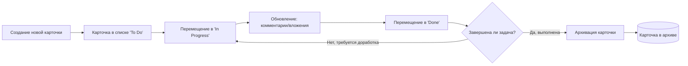

# Документ требований для продукта Organetto

## Анализ рынка и конкурентов

* **Trello:** Один из самых популярных канбан-инструментов для команд любого размера. Привлекает простым визуальным интерфейсом и бесплатной базовой версией. Однако **Trello** оптимален лишь для небольших команд с несложными проектами – при усложнении работы его возможностей не хватает (нет встроенного учета времени, ограниченная аналитика и т.д.). Например, обзор G2 отмечает, что Trello *«достаточен для небольшой команды с простым проектом, но с комплексными проектами не справляется; в Trello нет таких продвинутых функций, как трекинг времени, и он не рассчитан на очень большое число задач и участников»*\${33†L1-L4}\_. С 2024 года бесплатный план Trello ограничивает рабочую область 10 участниками и 10 досками, что вынуждает растущие команды переходить на платный тариф (иначе доски становятся только для чтения).

* **Jira:** Мощная система управления проектами от Atlassian, ориентированная прежде всего на команды разработчиков ПО и крупные организации. **Jira** предоставляет богатый функционал: отслеживание задач и багов, agile-доски (канбан, скрам), дорожные карты, отчеты, интеграции с другими инструментами и др.. При этом Jira значительно сложнее в использовании по сравнению с Trello – пользователям требуется понимание методологий Agile и основ управления проектами для эффективной работы с ней. По сути, **Jira** предлагает “продвинутый” канбан с настраиваемыми рабочими процессами и масштабируемостью для больших команд, но ценой высокой сложности и кривой обучения. (Например, Jira хоть и имеет бесплатный план до 10 пользователей, по отзывам рядовых юзеров она слишком громоздка для небольших непрофильных команд.)

* **Monday.com:** Современная облачная платформа управления проектами, стремящаяся быть **“all-in-one”** решением. **Monday** поддерживает представления в виде канбан-досок, подобно Trello, но кроме этого предлагает намного более широкую гибкость и функциональность. Пользователь может настроить практически всё под свои нужды: собственные workflows, различные виды представления данных, дашборды и т.д. Платформа масштабируется от мелких команд до предприятий любого размера. Среди ключевых возможностей Monday – продвинутые отчеты и аналитика, чек-листы, автоматизации, интеграции со множеством сторонних сервисов (CRM, маркетинг и др.). Таким образом, Monday нацелена на организации, которым нужна более комплексная система управления работой; однако из-за обилия функций она может быть избыточной для простых личных проектов и требует платной подписки для полного набора возможностей.

* **Linear:** Относительно новый игрок, популярный среди IT-стартапов и разработчиков. **Linear** отличается быстрым, минималистичным интерфейсом и удобством работы – его часто выбирают небольшие Agile-команды, которым нужна быстрая реакция без перегрузки функциями. Linear поддерживает спринты, бэклог, ведение задач и интегрируется с популярными инструментами разработки (Slack, GitHub, etc.). В сравнении с Jira, Linear менее комплексен: в нем меньше встроенных интеграций (порядка 200+ против тысячи у Atlassian) и отсутствуют некоторые тяжелые функции, но зато почти не имеет «кривой обучения» и работает значительно проще для рядовых пользователей. Проще говоря, **Linear** концентрируется на быстром управлении задачами разработки для маленьких команд, тогда как Jira рассчитана на масштаб и богатый функционал для больших организаций.

* **Wekan:** Открытый исходный код (open-source) в мире канбана. **Wekan** позиционируется как бесплатная альтернатива Trello с аналогичным подходом (доски, списки, карточки). Его можно развернуть на своем сервере, что привлекает тех, кто ценит контроль над данными и отсутствие лицензионных расходов. Однако по удобству и возможностям Wekan заметно уступает коммерческим продуктам. Пользователи отмечают, что в Trello гораздо проще начать работу: интуитивный интерфейс Trello оценивается значительно выше (9.1 против 6.4 у Wekan по данным G2). Trello предлагает более развитые функции автоматизации и поддержки пользователей (оценка поддержки 8.5 vs 6.3 у Wekan). Таким образом, **Wekan** покрывает базовые потребности канбан-доски и привлекателен отсутствием платы, но требует больших технических усилий на установку/обслуживание и не предоставляет уровня сервиса, сопоставимого с облачными продуктами.

*(Примечание: На российском рынке описанные продукты также присутствуют. Trello и Jira широко используются в компаниях, Monday и Linear – нишевые, а Wekan и другие open-source решения популярны у отдельных команд, требующих локального хостинга. Именно поэтому Organetto важно учесть локализацию и потребности небольших команд в РФ.)*

## Бизнес-требования (BRD)

Ниже перечислены ключевые бизнес-цели и ограничения для Organetto – пронумерованные требования BR-1, BR-2 и т.д. Каждый пункт отражает необходимый результат с точки зрения продукта, а также включает показатели успеха, риски или допущения, связанные с ним.

* **BR-1: Фокус на целевом сегменте.** Продукт должен быть нацелен на персональное использование и небольшие команды (5–20 человек), преимущественно на рынке России. Organetto должен решать задачи управления личными и малыми проектами лучше конкурентов за счет простоты и локализации. *Ключевой показатель*: достижение X регистраций пользователей из целевой аудитории в течение первых N месяцев после запуска (например, 5 000 регистраций за 6 месяцев). *Успех:* если 80% этих пользователей создают хотя бы одну доску в первую неделю после регистрации (метрика активации).

* **BR-2: Модель монетизации Freemium.** Принята стратегия **freemium**: базовые функции доски предоставляются бесплатно для привлечения широкой базы пользователей, а расширенные возможности – по платной подписке. Бесплатный план должен быть достаточно щедрым, чтобы заинтересовать команды (например, до 10–15 пользователей и ограниченное число активных досок, аналогично отраслевому стандарту), но мотивировать растущие команды переходить на платный тариф. *Цель*: конверсия не менее 5–10% активных команд из бесплатного в платный план за первый год работы продукта. *Показатели*: количество платных подписчиков, средний доход на пользователя (ARPU). *Риск:* слишком жесткие ограничения могут отпугнуть новых пользователей, поэтому баланс бесплатных лимитов регулярно пересматривается.

* **BR-3: УТП – простота и совместная работа в реальном времени.** Organetto должен дифференцироваться на рынке за счет сочетания **легкости использования** (как у Trello) и **мгновенной совместной работы** (реaltime обновления для всех участников доски). Эта уникальная ценностная пропозиция призвана привлечь пользователей, которым слишком сложны Jira/Monday, но не хватает возможностей в простом офлайн-трекере. *Цель*: добиться показателя удовлетворенности пользователей (NPS) не ниже +50 за счет удобства интерфейса и отзывчивости системы. *Метрики успеха*: доля пользователей, активно сотрудничающих на досках (например, >3 участников на среднюю доску), время отклика интерфейса < 0,5 с при действиях на доске (перетаскивание карточек и пр.). *Риск:* конкуренты могут улучшить свои продукты (например, Trello добавит сходные realtime-функции), поэтому важно постоянно поддерживать высокое качество UX.

* **BR-4: Рост пользовательской базы и сетевой эффект.** Ключевая бизнес-цель – наращивание базы активных пользователей. Необходимо обеспечить быстрый прирост MAU (Monthly Active Users) за счет вирусного эффекта: наличие функций приглашения участников и **публичных досок** для широкой аудитории. *Показатели*: MAU через 6 месяцев – не менее Y (например, 3 000 MAU), коэффициент удержания (2-month retention) – не менее 40%. *Успех:* если каждый новый пользователь привлекает в среднем ≥1 другого (коэффициент рефералов ≥1), что свидетельствует о востребованности и вирусности продукта. *Риски*: (а) насыщенность рынка – придется конкурировать с уже известными брендами за внимание пользователей; (б) отсутствие офлайновой версии может ограничивать аудиторию.

* **BR-5: Конверсия в платные рабочие пространства и выручка.** Несмотря на ориентацию на массовую бесплатную базу, к концу первого года должно проявиться устойчивое ядро платящих клиентов (не менее Z команд на платном тарифе). *Цель*: достичь MRR (ежемесячный регулярный доход) в \$X к 12-му месяцу. При этом ценообразование должно быть конкурентоспособным (сопоставимо с Trello/Monday для малого бизнеса). *Метрика успеха*: коэффициент конверсии бесплатных рабочих пространств в платные ≥ 5%, средний срок жизни платного клиента (LTV) ≥ 12 месяцев. *Риски*: экономическая ситуация и ограниченные бюджеты малых команд (особенно в России) могут сдерживать оплату – необходим гибкий тариф (например, льготный план для образовательных или некоммерческих команд).

* **BR-6: Качество продукта и удовлетворенность пользователей.** Для удержания пользователей Organetto должен обеспечивать высокий уровень надежности, безопасности и поддержки. *Цель*: добиться оценки удовлетворенности/support rating не ниже 4.5 из 5. *Показатели*: процент ошибок (bug rate) < 1% от операций, время доступности сервиса (uptime) ≥ 99.5%, среднее время ответа поддержки < 24 часов. *Ограничения*: небольшая команда разработки накладывает ограничение на скорость внедрения новых функций – приоритет отдается стабильности и самым востребованным функциям. *Риск*: одна серьезная утечка данных или длительный сбой может подорвать доверие на раннем этапе, поэтому особое внимание – безопасности и мониторингу.

* **BR-7: Локализация и соответствие регулированию.** Для успешного выхода на российский рынок продукт должен быть локализован (интерфейс на русском языке, поддержка часовых поясов РФ, формат дат/чисел и т.п.) и учитывать правовые требования. *Требование*: соблюдение законодательства о персональных данных (например, ФЗ-152 в РФ) – хранение и обработка данных пользователей в соответствии с нормативами. *Мера успеха*: отсутствие претензий со стороны регуляторов, положительная обратная связь от пользователей касательно удобства локализованного интерфейса. *Риск*: возможны ограничения на использование зарубежных облачных сервисов (Firebase) в будущем – нужна стратегия по переносимости инфраструктуры при необходимости.

* **BR-8: Управление рисками конкуренции.** В условиях присутствия крупных конкурентов (Atlassian, Microsoft Planner, отечественные аналоги) проекту важно занять свою нишу. *Стратегия*: сосредоточиться на сегменте, которому крупные решения не уделяют должного внимания – индивидуальные пользователи и маленькие команды, желающие простого инструмента без лишних корпоративных сложностей. Organetto должен быстро собирать обратную связь и выпускать обновления под нужды этой аудитории. *Метрика*: доля отказов (churn) среди небольших команд < 15% в первый год. *Успех:* если в отзывах пользователи прямо указывают, что выбрали Organetto вместо Trello/Jira из-за лучшей адаптации под их потребности. *Риски*: агрессивная реакция конкурентов (например, демпинг цен или акционные предложения от Trello/Monday) – необходимо выстроить лояльное сообщество вокруг продукта и удерживать пользователей качеством сервиса.

*(Приведенные показатели и целевые значения являются предварительными и будут уточняться по мере получения данных о реальном использовании продукта.)*

## Требования пользователей

**Персоны и их потребности.** В рамках анализа были определены три основных типа пользователей (персон): **Владелец доски**, **Участник команды** и **Гость**. Ниже приводится описание каждой персоны, их ключевые боли (pain points) и ожидаемые выгоды (gains) от использования Organetto:

* **Владелец** (администратор доски или проекта). Это, как правило, инициатор использования инструмента – например, руководитель небольшой команды или автор личного проекта.

  * *Боли:* Отсутствие прозрачности и порядка в текущем управлении задачами; рассредоточенность информации (часть в чатах, часть в таблицах); сложности в координации команды без единого инструмента. Испытывает трудности с тем, чтобы все члены команды своевременно обновляли статус задач и не забывали о дедлайнах. Также обеспокоен стоимостью корпоративных решений – крупные платформы слишком дорогие или сложные. Наконец, опасается утечки данных или потери информации при использовании зарубежных сервисов.
  * *Ожидаемые выгоды:* Централизованный контроль над проектами – возможность видеть картину целиком по всем задачам на доске. Простота внедрения инструмента – чтобы команда начала пользоваться без длительного обучения (важна интуитивность интерфейса). Возможность **приглашать участников** и настраивать **права доступа** (приватность досок) для безопасного сотрудничества. Напоминания о дедлайнах и отчеты по прогрессу – чтобы ничто не ускользало. Низкий порог входа финансово: базовый функционал бесплатно, а при необходимости – разумная стоимость расширенных функций (подписка).

* **Участник команды** (Board Member). Обычный пользователь доски – сотрудник небольшой организации или соавтор проекта, который ежедневно работает с карточками задач.

  * *Боли:* Сложности с приоритизацией и отслеживанием своих задач, если инструменты неудобны. Перегруженные или слишком формальные системы (типа Jira) вызывают отторжение – много полей, бюрократии, медленная работа. При использовании разрозненных средств (почта, месенджеры, Excel) легко упустить важную задачу или забыть о сроке. Если инструмент не обновляет информацию в режиме реального времени, возникают конфликтные ситуации (двое изменили одну задачу одновременно и перезаписали друг другу данные). Отсутствие уведомлений о изменениях приводит к тому, что участник пропускает комментарии или новые поручения.
  * *Ожидаемые выгоды:* Удобный интерфейс канбан-доски, где можно **создавать задачи (карточки)**, легко перемещать их между колонками (статусами) и видеть прогресс. **Совместная работа в реальном времени** – чтобы сразу видеть, кто что изменил, без постоянного обновления страницы. Уведомления о новых комментариях, назначениях или приближающихся сроках – чтобы всегда быть в курсе. Возможность **прикреплять файлы** к задачам и обсуждать детали в комментариях, не уходя в почту. Интеграция с привычными инструментами (например, Google Drive для вложений) приветствуется. В целом, участник хочет сократить время на “ведение” задач и сосредоточиться на выполнении работы, используя Organetto как вспомогательный, а не мешающий инструмент.

* **Гость** (внешний наблюдатель или ограниченный участник). Это лицо, не являющееся постоянным членом команды, но которому предоставлен доступ к доске (например, клиент, подрядчик или коллега из другого отдела, которому нужно просматривать статус).

  * *Боли:* Нежелание проходить сложную регистрацию или обучаться работе с новым ПО ради эпизодического доступа. Столкновение с ситуацией, когда для просмотра статуса проекта ему высылают скриншоты или Excel-файлы, что неудобно и быстро устаревает. Ограниченные права доступа часто вызывают сложности: либо гость видит лишнее, либо, наоборот, не может получить нужной информации.
  * *Ожидаемые выгоды:* Возможность **легко просматривать доску** без лишних препятствий – идеальный вариант: по ссылке в браузере, без обязательной регистрации. Уверенность, что он ничего не сломает (т.е. права “только чтение” по умолчанию, либо ограниченное комментирование). Актуальная информация в любой момент – гость хочет открыть доску и сразу увидеть последние изменения статусов задач. Для некоторых гостей важно и возможность оставлять комментарии или прикреплять файлы (например, добавить отзыв или материалы по задаче) – если владелец разрешит. В целом, гость ценит прозрачность и простоту доступа, предоставленные Organetto.

**Jobs-to-be-Done (Основные задачи пользователей):** исходя из интервью с вышеописанными персонами, можно выделить ряд “работ”, которые пользователи стремятся выполнять с помощью Organetto:

* **Организация задач визуально.** Пользователи хотят переносить все текущие задачи в единое визуальное пространство (канбан-доску) и структурировать их по состояниям. Это упрощает понимание “картинки” проекта и не дает забыть ни одну задачу.
* **Совместное ведение проекта.** Командам важно, чтобы инструмент поддерживал одновременную работу нескольких человек: совместное редактирование доски, мгновенное отображение правок друг друга, обсуждение прямо на карточках.
* **Контроль сроков и ответственность.** Инструмент должен помогать отслеживать дедлайны: устанавливать даты на карточках, напоминать о приближении сроков ответственным. Также – фиксировать, кто отвечает за задачу, чтобы было видно распределение нагрузки.
* **Обмен информацией и материалами.** Пользователи ожидают, что на карточке задачи можно хранить все относящиеся к ней данные: описание, чек-лист задач, прикрепленные файлы, ссылки, комментарии. Благодаря этому коммуникация по задаче сосредоточена в одном месте, а не разбросана по почте и чатам.
* **Простота экспорта и обмена.** Владелец или участники могут потребовать поделиться статусом проекта с внешними стейкхолдерами – поэтому нужна возможность легко экспортировать данные доски (в PDF/CSV) или открыть ограниченный доступ для просмотра без регистрации.

**Пользовательские истории (User Stories):** На основе потребностей персонажей сформулированы основные пользовательские истории для Organetto. Каждая история описывает функциональность продукта с точки зрения конечного пользователя и содержит критерии приемки (формат Gherkin: **Допустим / Когда / Тогда**), уточняющие требования. Ниже пронумерованы истории US-1, US-2 и т.д., каждая снабжена критерием(ями) приемки.

* **US-1:** *Как **Владелец**, я хочу создать новую доску проекта и пригласить в нее участников*, чтобы моя команда могла совместно управлять задачами в одном месте.

  * **Критерии приемки:**

    * **Допустим**, я зарегистрирован в системе и нахожусь на своей странице Organetto.
    * **Когда** я создаю новую доску, указав её название, и приглашаю пользователей по email,
    * **Тогда** система должна отправить приглашения указанным адресатам, и после принятия приглашения участники получают доступ к этой доске с соответствующими правами.

* **US-2:** *Как **Владелец**, я хочу настраивать видимость доски (приватная, внутри рабочей области или публичная)*, чтобы контролировать, кто может просматривать и редактировать содержимое.

  * **Критерии приемки:**

    * **Допустим**, у меня создана доска по умолчанию приватная.
    * **Когда** я изменяю настройку доступа доски на “публичная”,
    * **Тогда** система генерирует общедоступную ссылку для просмотра, и любой, у кого есть эта ссылка, может просматривать (но не изменять) данную доску без авторизации.

* **US-3:** *Как **Участник команды**, я хочу добавлять новую карточку-задачу на доску с указанием деталей*, чтобы зафиксировать новую задачу и она была видна всей команде.

  * **Критерии приемки:**

    * **Допустим**, я являюсь участником приватной доски и нахожусь на этой доске.
    * **Когда** я создаю карточку, указав заголовок задачи и описание,
    * **Тогда** новая карточка появляется в выбранном списке (колонке) доски и становится видна всем членам команды на этой доске мгновенно.

* **US-4:** *Как **Участник**, я хочу перетаскивать карточки между колонками доски*, чтобы обновлять статус задач (например, из “Запланировано” в “В процессе”) на лету.

  * **Критерии приемки:**

    * **Допустим**, на доске есть карточка в колонке “To Do” (Запланировано).
    * **Когда** я перетаскиваю эту карточку мышью в колонку “In Progress” (В процессе),
    * **Тогда** статус карточки изменяется на соответствующий новой колонке, и все пользователи, открывшие эту доску, сразу видят перемещение карточки в новую колонку (без перезагрузки страницы).

* **US-5:** *Как **Участник**, я хочу оставлять комментарии к карточке и прикреплять файлы*, чтобы обсуждать детали задачи и делиться необходимыми материалами в контексте задачи.

  * **Критерии приемки:**

    * **Допустим**, я открываю карточку задачи на доске.
    * **Когда** я добавляю текстовый комментарий и загружаю файл-вложение к карточке,
    * **Тогда** мой комментарий отображается в ленте обсуждения этой карточки, а файл прикрепляется и становится доступен для просмотра/скачивания другим участникам. Все участники доски получают уведомление о новом комментарии в реальном времени.

* **US-6:** *Как **Участник**, я хочу устанавливать дедлайн (срок) для карточки и получать уведомления*, чтобы не пропустить выполнение задачи в назначенный срок.

  * **Критерии приемки:**

    * **Допустим**, у задачи назначена дата выполнения (due date) и ответственный – я.
    * **Когда** до наступления дедлайна остается 1 день,
    * **Тогда** система отправляет мне уведомление (например, email и пуш-уведомление в приложении) о том, что срок по задаче приближается. **И** если дедлайн просрочен, я получаю отдельное уведомление о просроченной задаче.

* **US-7:** *Как **Гость/наблюдатель**, я хочу просматривать содержимое общей (публичной) доски без необходимости регистрации*, чтобы быть в курсе статуса проекта, не создавая аккаунт.

  * **Критерии приемки:**

    * **Допустим**, Владелец сделал доску публичной и поделился со мной ссылкой.
    * **Когда** я перехожу по этой ссылке,
    * **Тогда** я вижу доску со всеми колонками и карточками в режиме “только чтение”. Я не могу вносить изменения (кнопки редактирования недоступны), но вся информация обновляется актуально. **И** если Владелец отключит публичный доступ, то по этой ссылке доска станет недоступна.

* **US-8:** *Как **Владелец/участник**, я хочу экспортировать данные доски в файл (PDF или CSV)*, чтобы поделиться статусом проекта в удобном формате вне системы или проанализировать задачи в таблице.

  * **Критерии приемки:**

    * **Допустим**, я открываю настройки/меню доски с задачами.
    * **Когда** я выбираю опцию экспорта “Выгрузить в CSV”,
    * **Тогда** система генерирует CSV-файл, содержащий список всех карточек на доске (с полями: название, описание, исполнитель, статус, дедлайн и т.д.), и предлагает скачать этот файл. **И** аналогично при экспорте в PDF – формируется читаемый PDF-документ с колонками и карточками, как на доске, для печати или отправки.

* **US-9:** *Как **Владелец**, я хочу при необходимости улучшить свой план обслуживания (перейти на премиум-подписку)*, чтобы снять ограничения бесплатного тарифа (на количество участников, объем вложений и др.) по мере роста команды или проекта.

  * **Критерии приемки:**

    * **Допустим**, моя рабочая пространство достигло лимита бесплатного плана (например, 10 пользователей).
    * **Когда** я оформляю платную подписку (ввод платежных данных и подтверждаю покупку тарифа Organetto Pro),
    * **Тогда** ограничения, действующие на бесплатном плане, сразу снимаются: я могу приглашать больше пользователей, создавать неограниченное число досок, а также появляются дополнительные функции премиум-плана (например, увеличенный размер файлов-вложений, наблюдатели с ограниченными правами и др.).

*(Все пользовательские истории выше согласованы с целями бизнеса и лягут в основу разработки функций. Далее описываются функциональные требования системы, вытекающие из этих историй.)*

## Функциональные требования (FR)

Ниже перечислены функциональные требования к системе Organetto, пронумерованные как FR-1, FR-2 и т.д. Требования охватывают как непосредственно функции продукта, так и важные нефункциональные аспекты (производительность, безопасность, локализация). Каждое требование будет далее связано с соответствующими бизнес- и пользовательскими требованиями (см. раздел “Трассировка требований”).

* **FR-1: Создание и управление досками.** Система должна предоставлять пользователю возможность создавать новую канбан-доску, указывать её название и описание. Владелец доски может приглашать других пользователей по email для совместной работы. Необходимо предусмотреть роли доступа: **владелец**, **редактор (участник)** и **наблюдатель (гость)**. Владелец может передавать права владения и удалять доску. *Примечание:* После создания доски автоматически создаются типовые колонки (например, “TODO/Doing/Done”), которые пользователь затем может переименовать или настроить.

* **FR-2: Настройка видимости доски и прав.** Реализовать механизм **управления доступом** к доскам: приватные доски (видны только приглашенным участникам), доски рабочей области (видны всем членам определенного Workspace/организации) и публичные доски (доступны по прямой ссылке для чтения). Должна быть возможность генерировать и отключать публичную ссылку. Права доступа: наблюдатель (только чтение), участник (чтение/запись на доске), администратор. *Валидации:* Только владелец/админ может менять настройки доступа. При снятии публичного статуса все неавторизованные сессии просмотра должны быть немедленно отключены.

* **FR-3: Управление списками и карточками.** Система должна позволять добавлять на доску произвольное количество **колонок** (списков) и **карточек**. Карточка как минимальная единица задачи содержит: заголовок (обязательное поле), описание (опционально), метки/теги (опционально), назначенного ответственного пользователя (опционально), дедлайн (опционально), перечень подзадач (чек-лист), вложения и комментарии. Карточку можно редактировать, перемещать между колонками или вверх/вниз внутри колонки (смена порядка). Удаление карточки возможно с подтверждением, при этом данные (включая вложения и комментарии) удаляются или архивируются (см. FR-4). *Ограничения:* заголовок карточки – до 255 символов; одна колонка может содержать до 1000 карточек (производительность UI). При попытке превысить лимиты должны выводиться ошибки валидации.

* **FR-4: Drag-and-drop и обновление статусов.** Интерфейс доски должен поддерживать интерактивное **перетаскивание (drag & drop)** карточек: пользователь может схватить карточку и переместить ее в другую колонку или в другое место текущей колонки. При отпускании карточки система должна обновить её атрибут “статус/колонка” и порядковый индекс. Обновление должно произойти мгновенно на клиенте с последующей синхронизацией на сервере. *Требование по UX:* визуально отображать место, куда карточка будет вставлена, и менять цвет карточки (или колонку выделять) при перетаскивании для наглядности. *Валидации:* нельзя перемещать карточку на доску, к которой у пользователя нет прав записи; при ошибке сети или конфликте изменений – возвращать карточку в исходное положение и показывать сообщение об ошибке.

* **FR-5: Комментирование карточек.** Реализовать возможность **добавлять комментарии** к карточке. Комментарий включает текст (поддержка базового форматирования Markdown желательна) и информацию об авторе и времени. Комментарии отображаются в хронологическом порядке в ленте обсуждения карточки. *Требования:* после добавления комментария всеми участниками доски он должен быть виден практически мгновенно (см. realtime FR-9). Участник должен иметь возможность редактировать или удалять свои комментарии (при удалении вместо текста отображается пометка). Владелец/админ доски может удалять любые комментарии (для модерации). *Нефункционально:* текст комментария макс. 1000 символов; вложения в комментариях – см. FR-6.

* **FR-6: Вложения и файлы.** Система должна позволять **прикреплять файлы** к карточкам (например, изображения, документы PDF и т.д.). Файл сохраняется на сервере (или облачном хранилище) и доступен для скачивания всем, кто имеет доступ к карточке. *Ограничения:* для бесплатных пользователей размер одного файла ограничен, например, 10 МБ, и общее пространство на команду – 1 ГБ; для премиум – более высокие лимиты (например, 100 МБ на файл, 10 ГБ общие). Поддерживать проверку типа файла и блокировать опасные расширения (исполняемые файлы) из соображений безопасности. *Функционал:* показывать превью для изображений; список всех вложений карточки хранится в ней. Владелец карточки или админ доски может удалять вложения. *Интеграция:* желательно предусмотреть поддержку drag\&drop файлов из проводника прямо на карточку для загрузки.

* **FR-7: Дедлайны и уведомления.** Для каждой карточки может быть установлена **дата выполнения (due date)** и ответственный пользователь. Система должна мониторить приближение и наступление дедлайна и отправлять уведомления: как минимум, электронное письмо ответственному за 24 часа до срока и при просрочке задачи. Также уведомления отображаются внутри приложения (в центре уведомлений или пуш-сообщением, если онлайн). *Рассылка:* через фоновые задачи (cron) ежедневно проверяются задачи с дедлайном. *Настройки:* пользователь может отключить или настроить время уведомления (например, за 1 день или за 1 час до). При отметке задачи как завершенной до дедлайна – уведомление не отправляется. *Нефункциональное:* интеграция с календарем (iCal feed) – как необязательное улучшение, чтобы пользователь мог подписаться на дедлайны доски в своем календаре.

* **FR-8: Поиск и фильтрация.** Предусмотреть функцию **поиска** по доске: пользователь может искать карточки по названию/тегам. Фильтрация по меткам, ответственным, статусу (колонке) также должна быть доступна, чтобы удобно просматривать, например, только свои задачи или только задачи с просроченным дедлайном. *Требование производительности:* поиск должен выполняться практически мгновенно на средних объемах (до 1000 карточек на доску) – возможно, реализован на клиенте для открытой доски или с использованием индексации на сервере. Результат поиска/фильтрации отображается как поднабор карточек непосредственно на доске (скрывая остальные).

* **FR-9: Реалтайм-синхронизация (SignalR).** Все изменения, происходящие на доске, должны **немедленно отображаться** у других пользователей, которые эту доску просматривают. Для этого backend использует механизм WebSockets (в данном случае SignalR в ASP.NET Core) для отправки уведомлений клиентам о событиях: добавлена/удалена/изменена карточка, перемещена карточка, добавлен комментарий, изменена колонка и т.п. *Технически:* при каждом изменении сервер рассылает соответствующее событие всем клиентам, подписанным на данную доску. *Требования:* задержка между действием одного пользователя и обновлением интерфейса у других – не более 1-2 секунд. При потере соединения клиент автоматически пытается переподключиться. *Валидация:* если пользователь не имеет прав на измененную сущность (например, гость при попытке добавить карточку) – изменение не производится, и у него интерфейс не изменится (при этом сервер все равно рассылает событие об отклонении, если нужно).

* **FR-10: Аутентификация и управление аккаунтом.** Для работы с приватными досками пользователь должен зарегистрироваться и войти в систему. **Firebase Authentication** обеспечивает авторизацию: поддерживается вход по email+паролю, а также OAuth-провайдеры (Google, возможно, Яндекс.ID для локального рынка). *Функционал:* подтверждение email при регистрации, восстановление пароля. Неавторизованные пользователи могут только просматривать публичные доски по ссылке (FR-2). *Безопасность:* хранение паролей – только в Firebase (шифрование и best practices Google). *Управление аккаунтом:* пользователь может изменить имя профиля, аватар; удалить свой аккаунт (при этом нужно удалять или передавать права на созданные им доски). Администраторы системы (операторы Organetto) имеют возможность блокировать аккаунты при нарушении условий использования.

* **FR-11: Разграничение тарифов (Free/Premium).** Система должна различать **бесплатные** и **платные** рабочие области (workspaces) или аккаунты. *Для бесплатного тарифа* применяются ограничения: ограниченное число активных досок (например, 5), ограничение на участников в одной рабочей группе (например, 10 пользователей на Workspace), ограничения на объем файлов (см. FR-6) и отсутствие некоторых бизнес-функций (например, наблюдатели, экспорт в PDF). *Для платного тарифа* ограничения сняты или увеличены, а также доступны продвинутые функции (например, история изменений карточки, настраиваемые поля, интеграция с внешними сервисами и пр.). Система должна обеспечивать проверку тарифных лимитов при операциях: напр., при попытке добавить 11-го пользователя в бесплатную команду – выдавать ошибку с предложением обновить тариф. Переключение тарифа происходит автоматически после подтверждения оплаты (через интеграцию с платежным шлюзом, не описывается здесь). Также необходим функционал напоминания о продлении подписки и ограничения функционала, если подписка истекла (grace period, затем блокировка создания нового контента сверх лимитов).

* **FR-12: Локализация интерфейса (i18n).** Приложение должно поддерживать **многоязычный интерфейс**. На старте приоритетны два языка: русский (основной, по умолчанию) и английский. Все текстовые элементы UI должны загружаться из языковых файлов/ресурсов; должна быть возможность переключения языка пользователем. Форматы дат, чисел – локализованы (для русского формат даты дд.мм.гггг, начало недели с понедельника и т.д.). *Технически:* использовать возможности фреймворка (например, Vue i18n для фронтенда). *Дополнительно:* обеспечивать поддержку юникода для хранения текстов (чтобы пользователи могли вводить задачи на любом языке, в т.ч. эмодзи). **Документация и поддержка** также должны быть локализованы для русскоязычных пользователей (в перспективе).

* **FR-13: Производительность и масштабируемость (NFR).** Organetto должен эффективно работать в заявленном диапазоне использования. *Производительность:* время загрузки доски с 100 карточками – не более 2 секунд на среднем оборудовании; интерфейс не должен “фризить” при перетаскивании карточек. Серверная часть должна выдерживать одновременную работу, например, 1000 активных пользователей (на нескольких досках) без деградации отклика. *Масштабируемость:* архитектура (SignalR + ASP.NET Core + БД) должна допускать горизонтальное масштабирование – например, разделение по рабочим пространствам или использование Redis для координации WebSocket-сессий между серверами. *Мониторинг:* внедрить базовый мониторинг производительности (APM, метрики запросов) для анализа узких мест.

* **FR-14: Безопасность и резервирование (NFR).** Данные пользователей (карточки, вложения, комментарии) должны храниться безопасно. *Требования безопасности:* вся связь клиент-сервер по HTTPS; проверка прав доступа на каждом запросе (чужой пользователь не может получить данные чужой доски через API). Должна быть реализована защита от основных уязвимостей веб-приложений (OWASP Top 10): проверка вводимых данных (XSS, SQL Injection – если применимо, т.к. ORM), ограничения по попыткам входа (защита от перебора пароля), captcha при подозрительной активности. *Резервное копирование:* регулярный бэкап базы данных (например, ежесуточно) с хранением копий не менее 30 дней. Предусмотреть экспорт данных пользователем (см. FR-8) как часть стратегии резервирования на стороне клиента. *Конфиденциальность:* соответствие политике GDPR и аналогичным требованиям – например, получение согласия на обработку персональных данных, предоставление пользователю возможности удалить свои данные. *Логирование:* значимые действия (создание/удаление досок, приглашение пользователей, входы в систему) логируются для возможного аудита безопасности.

* **FR-15: Интеграции и API (расширяемость).** Предусмотреть возможность интеграции с внешними сервисами по мере развития продукта. *API:* Желательно реализовать открытый REST API для основных операций (CRUD досок, карточек) с использованием аутентификации по токену, чтобы сторонние разработчики или команды могли автоматизировать взаимодействие (например, синхронизация задач из git-репозитория). *Вебхуки:* для важных событий (создана карточка, изменен статус, наступил дедлайн) предоставить оповещения через webhook URL, настраиваемые владельцем доски. *Предустановленные интеграции:* рассмотреть интеграцию со Slack/Telegram для отправки уведомлений о задачах в командной чат, с Google Calendar – для экспортирования дедлайнов, с Google Drive/Яндекс Диск – для хранения вложений. Эти интеграции могут входить в премиум-план. Хотя данные интеграции могут выходить за рамки базового функционала, архитектура должна предусматривать их добавление (чёткое разделение слоев, наличие модулей/сервисов, работающих с внешними API, и т.д.).

*(Примечание: функциональные требования FR-13..FR-15 являются нефункциональными/системными, но они перечислены под номером FR для полноты и будут учитываться при реализации и тестировании качества продукта.)*

## Трассировка требований

В таблице ниже приведено соответствие между функциональными требованиями (FR) и связанными с ними бизнес-требованиями (BR) и пользовательскими историями (US). Это демонстрирует, как каждая функция системы удовлетворяет потребности пользователей и способствует достижению бизнес-целей:

| **Функциональное требование (FR)**                                           | **Связанные бизнес-требования (BR)**                                     | **Связанные пользовательские истории (US)**                                                                                                                               |
| ---------------------------------------------------------------------------- | ------------------------------------------------------------------------ | ------------------------------------------------------------------------------------------------------------------------------------------------------------------------- |
| **FR-1: Создание/управление досками** – приглашение участников, роли доступа | BR-1 (ориентация на малые команды), BR-4 (рост базы через приглашения)   | US-1 (создать доску и пригласить), US-2 (настройка приватности)                                                                                                           |
| **FR-2: Настройка видимости доски** (приватная/публичная, права)             | BR-1 (локальный фокус: приватность), BR-3 (простота сотрудничества)      | US-2 (менять видимость доски), US-7 (просмотр гостем)                                                                                                                     |
| **FR-3: Списки и карточки (CRUD задач)** – содержание задачи, атрибуты       | BR-3 (функциональное УТП продукта), BR-6 (качество продукта)             | US-3 (добавить задачу), US-5 (полное содержание карточки)                                                                                                                 |
| **FR-4: Drag & drop и обновление статуса** (UX канбана)                      | BR-3 (удобство и realtime), BR-8 (конкурентное преимущество)             | US-4 (перемещение карточки), US-3 (обновление статуса при добавлении)                                                                                                     |
| **FR-5: Комментирование задач** – обсуждение в контексте                     | BR-3 (совместная работа), BR-6 (удовлетворенность пользователей)         | US-5 (комментировать задачу)                                                                                                                                              |
| **FR-6: Вложения файлов** – хранение материалов                              | BR-3 (полезность для команд), BR-5 (монетизация через лимиты)            | US-5 (прикрепить файл к задаче)                                                                                                                                           |
| **FR-7: Дедлайны и уведомления** – напоминания о сроках                      | BR-6 (качество продукта), BR-3 (ценность для продуктивности)             | US-6 (получить уведомление о дедлайне)                                                                                                                                    |
| **FR-8: Поиск/фильтрация задач** – быстрое ориентирование                    | BR-6 (качество, удобство), BR-3 (простота использования)                 | (Косвенно все пользовательские истории, связанные с работой на доске – ускоряет выполнение их задач)                                                                      |
| **FR-9: Real-time синхронизация (SignalR)** – мгновенное обновление          | BR-3 (реальное УТП: realtime), BR-8 (обгон конкурентов по скорости)      | US-4 (видеть перемещение сразу), US-5 (увидеть новый комментарий)                                                                                                         |
| **FR-10: Аутентификация и аккаунты** – безопасный доступ                     | BR-7 (соответствие требованиям безопасности), BR-6 (надёжность сервиса)  | (Предусловие для всех приватных пользовательских историй: US-1..US-6 требуют авторизации)                                                                                 |
| **FR-11: Разграничение Free vs Premium** – лимиты и опции                    | BR-2 (freemium модель монетизации), BR-5 (конверсия в выручку)           | US-9 (апгрейд до премиум), также влияет на US-1..US-8 (свободное использование до лимитов)                                                                                |
| **FR-12: Локализация (RU/EN)** – язык интерфейса                             | BR-1 (ориентация на российский рынок), BR-7 (локальное соответствие)     | (Непрямая связь: все RU-пользователи – т.е. все истории – выигрывают от локализации интерфейса)                                                                           |
| **FR-13: Производительность системы** – быстрая работа                       | BR-3 (удобство → высокая оценка UX), BR-6 (качество и удовлетворенность) | US-4 (гладкое перетаскивание), US-3 (быстрое создание задачи)                                                                                                             |
| **FR-14: Безопасность и резервирование** – защита данных                     | BR-7 (соответствие законам, доверие), BR-6 (надежность)                  | (Косвенно все истории: пользователи ожидают безопасное хранение задач и доступ только для своих команд)                                                                   |
| **FR-15: API и интеграции** – расширяемость                                  | BR-8 (конкурентное позиционирование через экосистему)                    | (Дополнительно для владельцев/админов: возможность интеграции не явилась явной частью историй текущей версии, но отвечает будущим потребностям продвинутых пользователей) |

**Диаграмма – жизненный цикл карточки (BPMN):** ниже представлена схема, иллюстрирующая процесс работы с задачей на доске Organetto – от создания карточки до её завершения и архивирования:

*(На диаграмме: задача создается в исходном списке, затем проходит стадии выполнения, может возвращаться на доработку, и в конце концов, после отметки выполнения – архивируется. Весь процесс сопровождается комментариями, изменениями статусов, которые отражаются у всех участников в реальном времени согласно FR-9.)*

### Заключение

Документ отразил всесторонний анализ для продукта **Organetto**: мы рассмотрели конкурентную среду (выявив ориентиры для функциональности и позиционирования), определили бизнес-цели (включая метрики успеха и риски), собрали требования от имени пользователей (персоны, их боли/гейны, сценарии использования) и сформулировали подробные функциональные требования к системе. Представленная информация призвана служить основой для разработки **Organetto** – легкого и удобного канбан-инструмента, способного занять свою нишу на рынке и удовлетворить потребности небольших команд и индивидуальных пользователей, особенно в российском контексте. Предложенные требования и метрики будут уточняться по мере эволюции продукта, однако уже на текущем этапе они задают четкое направление для дизайна и реализации системы.
